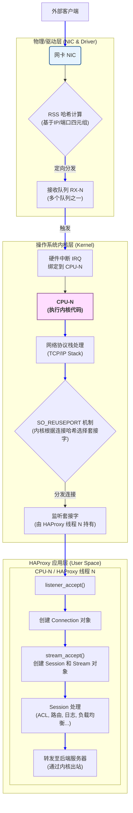

 # 整个流程可以看作一个清晰的链条：

   1. `Event` (Read on Listening Socket): 监听套接字上有新连接事件。
       * 触发 listener_accept()。

   2. `listener_accept()`:
       * 创建 cli_conn (物理连接)。
       * 调用 stream_accept()。

   3. `stream_accept()`:
       * 创建 session (事务)。
       * 创建 stream (数据流)。
       * 将 cli_conn 关联到 stream。
       * 创建并启动一个初始的 task 来处理这个 stream。

   4. `Task` (e.g., `process_stream`):
       * 开始处理 stream 上的数据。
       * 当需要等待 I/O 时（数据不够或等待对端），它会向事件循环注册对 cli_conn->fd 的 read 或 write `Event` 的兴趣，然后暂停。

   5. `Event` (Read/Write on `cli_conn->fd`):
       * 当注册的 I/O 事件发生时，事件循环唤醒并重新调度对应的 Task。
       * Task 继续执行，处理数据，周而复始，直到 session 结束，cli_conn 被关闭。

  这个模型使得 HAProxy 可以用极少的线程（通常每个 CPU核心一个）高效地处理数十万甚至上百万的并发连接。


  ##   线程（通常每个 CPU核心一个）和task、session的关系

✦ Excellent question. This gets to the heart of HAProxy's high-performance concurrency model. Let's clarify the relationship between these three concepts.

  1. 线程 (Thread) - 执行者

   * 角色: 线程是真正由操作系统调度的执行单元。在 HAProxy 中，当你配置 nbthread > 1 时，它会启动多个工作线程。通常，最佳实践是让线程数等于 CPU 核心数，并将每个线程绑定（pin）到一个特定的 CPU 核心上。
   * 独立性: 每个线程都是一个独立的“工人”。它拥有自己独立的事件循环（I/O Poller）和任务调度器。线程之间几乎不共享数据，这避免了昂贵的锁竞争，是 HAProxy 高性能的关键。
   * 工作内容: 一个线程的主要工作就是不断地：
       1. 询问操作系统：“我负责的这一堆连接里，有哪些准备好读或写了？”（事件循环）
       2. 根据返回的事件，找到对应的任务。
       3. 执行这些任务。

  2. Session - 工作对象

   * 角色: 如前所述，session 代表一个完整的客户端事务。它是一个逻辑上的概念，是线程需要处理的“工作对象”或“客户订单”。
   * 与线程的关系：亲和性 (Affinity)
       * 一个 Session 永远只属于一个线程。
       * 当一个新连接被 accept 后，listener_accept 中的负载均衡逻辑会为这个连接（以及即将创建的 session）选择一个最合适的线程来处理。
       * 一旦选定，这个 session 的整个生命周期——从解析请求、转发到后端、接收响应、再到关闭连接——都将完全由这一个线程负责。
       * 为什么这很重要？ 因为 session 的所有数据（包括其 stream 和 connection 的数据）都只被一个线程访问，所以完全不需要加锁来进行跨线程同步，极大地提升了处理效率和 CPU 缓存命中率。

  3. Task - 工作步骤

   * 角色: task 是完成一个 session 所需的、具体的、可执行的“工作步骤”。它不是一个线程，而是一个由 HAProxy 自己的调度器管理的数据结构。
   * 与线程的关系：协作式调度 (Cooperative Scheduling)
       * 一个线程在任何一个时刻只能执行一个 task。
       * 线程的调度器维护着一个“可运行任务”队列。当一个 session 因为等待 I/O 而暂停时，它的 task 就从队列中移除。当 I/O 事件发生，session 可以继续工作时，它的 task 就被重新放回队列。
       * 线程从队列中取出一个 task，执行它。这个 task 会一直运行，直到它主动让出 CPU。它只会在需要等待 I/O 时才会主动让出，这就是所谓的“协作式”。它永远不会被同一个线程中的另一个 task 强行中断（非抢占式）。

  总结与比喻

  我们可以用一个厨房的例子来比喻：

   * 线程 (Thread): 一位厨师。一个厨房里可以有多位厨师，每位厨师有自己独立的灶台和工具区。
   * Session: 一张顾客的订单（比如一份牛排套餐）。
   * Task: 烹饪订单中的一个具体步骤（比如“切洋葱”、“把牛排下锅”、“给土豆泥调味”）。

  工作流程如下：

   1. 一张新订单 (session) 来了，被分配给最不忙的厨师 (thread)。这张订单就永远是这位厨师的了。
   2. 厨师 (thread) 拿起订单 (session)，开始执行第一个步骤 (task)，比如“把牛排下锅”。
   3. 牛排需要煎 5 分钟（等待 I/O）。厨师不会傻等 5 分钟，他设置一个定时器（注册 I/O 事件），然后把这张订单先放一边，接着拿起另一张订单 (session) 的某个步骤 (task) 去做，比如“切洋葱”。
   4. 5 分钟后，定时器响了（I/O 事件发生）。厨师知道那份牛排的下一步“翻面” (task) 现在可以执行了。他就会在切完手里的洋葱后，回来给牛排翻面。

  层级关系一目了然：

   * 一个 HAProxy 进程包含多个 线程 (Thread)。
   * 每个 线程 负责处理成千上万个 Session。
   * 每个 Session 的处理过程被分解为一系列的 Task。
   * 线程 通过快速地在不同的 Task 之间切换来并发处理所有的 Session。

## 线程和cpu绑定

✦ 好的。HAProxy 中处理线程与 CPU 绑定的核心逻辑主要涉及两个部分：

   1. 配置解析：解析 global 配置段中的 cpu-map 指令。
   2. 线程创建与绑定：在主进程 fork 出子进程或创建线程后，根据解析的 cpu-map 配置来调用系统调用设置 CPU 亲和性（Affinity）。

  这部分代码是平台相关的，主要在 src/cpuset.c 文件中实现，并在主程序 haproxy.c 中被调用。

  1. 核心实现: src/cpuset.c

  这个文件封装了设置 CPU 亲和性的底层操作。

   * `cpuset_create_from_string(const char *s, char err)`**:
      这个函数负责解析 cpu-map 配置字符串。cpu-map 的格式类似 1-3 5 10-12。它会将这个字符串转换成一个 cpu_set_t 位掩码。

   * `cpuset_apply_affinity(const struct cpuset *set)`:
      这是执行绑定的核心函数。它接收一个 cpuset 结构体（其中包含了 cpu_set_t 掩码），并调用 sched_setaffinity 系统调用将当前进程或线程绑定到掩码指定的 CPU 核心上。

  以下是 cpuset_apply_affinity 函数的简化片段，展示了其核心操作：

    1 // In src/cpuset.c
    2 
    3 #if defined(USE_CPU_AFFINITY) && defined(HAVE_SCHED_SETAFFINITY)
    4 int cpuset_apply_affinity(const struct cpuset *set)
    5 {
    6     // sched_setaffinity(pid, cpusetsize, mask)
    7     // pid = 0 表示对当前调用线程进行操作
    8     if (sched_setaffinity(0, sizeof(cpu_set_t), &set->map) == -1) {
    9         // ... error handling ...
   10         return -1;
   11     }
   12     return 0;
   13 }
   14 #endif

  2. 调用位置: haproxy.c

  在 HAProxy 的主函数 main() (位于 haproxy.c) 中，线程的创建和绑定发生在 run_threads() 函数里。

  run_threads() 的逻辑大致如下：

   1. 循环创建所需数量的线程（根据 global.nbthread）。
   2. 在每个新线程的启动函数 (thread_proxy()) 中，会根据当前线程的 ID 和 cpu-map 的配置来决定它应该绑定到哪个 CPU。
   3. 调用 cpuset_apply_affinity() 来执行绑定。

  以下是 haproxy.c 中相关逻辑的示意代码：

    1 // In haproxy.c
    2 
    3 // 全局变量，存储从 cpu-map 解析来的 cpuset
    4 static struct cpuset **cpusets;
    5 
    6 /* This is the thread entry point */
    7 static void *thread_proxy(void *args)
    8 {
    9     int thread_num = (long)args;
   10     // ... 其他初始化 ...
   11 
   12     // 如果配置了 cpu-map
   13     if (cpusets && cpusets[thread_num]) {
   14         // 调用 src/cpuset.c 中的函数来应用绑定
   15         if (cpuset_apply_affinity(cpusets[thread_num]) < 0) {
   16             ha_warning("Could not apply CPU affinity to thread %d.\n", thread_num);
   17         }
   18     }
   19 
   20     // ... 进入线程主循环 ...
   21     run_poll_loop();
   22     return NULL;
   23 }
   24 
   25 static void run_threads(void)
   26 {
   27     // ...
   28     for (i = 0; i < global.nbthread; i++) {
   29         // ...
   30         // 创建线程，入口点是 thread_proxy
   31         if (pthread_create(&thread, &attr, thread_proxy, (void *)(long)i) != 0) {
   32             // ... error handling ...
   33         }
   34         // ...
   35     }
   36     // ...
   37 }
   38 
   39 // 在 main() 函数中，解析配置后会调用
   40 // cpusets = cpuset_parse_cpu_map(global.cpu_map);
   41 // 然后调用 run_threads()

  总结

   1. 配置：用户在 haproxy.cfg 的 global 段中设置 cpu-map 1/1 2/2 3/3 ...，指定哪个线程（从1开始）绑定到哪个 CPU 核心。
   2. 解析：HAProxy 启动时，main 函数会调用 cpuset_parse_cpu_map() (位于 src/cpuset.c)，将 cpu-map 字符串解析成一个 cpuset 结构体数组 cpusets。
   3. 创建：main 函数调用 run_threads() 来创建所有工作线程。
   4. 绑定：每个新创建的线程在启动后，会执行其入口函数 thread_proxy()。在该函数内部，它会根据自己的线程号从 cpusets 数组中找到对应的 cpuset，然后调用 cpuset_apply_affinity()，最终通过 sched_setaffinity(0, ...)
      将自己绑定到指定的 CPU 核心上。

> 请举例说明

✦ 好的，我们通过一个具体的例子来演示 HAProxy 中线程与 CPU 绑定的过程。

  示例场景

  假设你的服务器有 4 个 CPU 核心（编号 0, 1, 2, 3），并且你希望 HAProxy 启动 4 个工作线程，每个线程绑定到一个独立的 CPU 核心上，以最大化性能和避免上下文切换开销。

  1. HAProxy 配置 (`haproxy.cfg`)

  你会在 global 配置段中这样设置：

   1 global
   2     nbthread 4  # 启动 4 个工作线程
   3 
   4     # 将每个线程绑定到特定的 CPU 核心
   5     cpu-map 1 0  # 线程 1 绑定到 CPU 核心 0
   6     cpu-map 2 1  # 线程 2 绑定到 CPU 核心 1
   7     cpu-map 3 2  # 线程 3 绑定到 CPU 核心 2
   8     cpu-map 4 3  # 线程 4 绑定到 CPU 核心 3

  2. 配置解析阶段 (`cpuset_parse_cpu_map`)

  当 HAProxy 启动并加载配置时：

   * 它会读取 nbthread 4，知道需要创建 4 个线程。
   * 它会解析 cpu-map 指令。对于每个 cpu-map 行：
       * cpu-map 1 0：HAProxy 会为线程 ID 1（在内部通常对应数组索引 0）创建一个 cpuset 结构体。这个结构体内部的 cpu_set_t 位掩码中，只有第 0 位被设置为 1。
       * cpu-map 2 1：为线程 ID 2（数组索引 1）创建一个 cpuset，其 cpu_set_t 中只有第 1 位被设置为 1。
       * 以此类推，直到为所有 4 个线程都创建了对应的 cpuset 结构体，并存储在一个 cpusets 数组中。

  3. 线程创建阶段 (`run_threads`)

  HAProxy 的主进程会调用 run_threads() 函数，该函数会循环 4 次，每次调用 pthread_create() 来创建一个新的 POSIX 线程。

   * 第一次循环：pthread_create() 创建线程 1，并传递参数 (void *)(long)0（表示线程索引 0）。
   * 第二次循环：pthread_create() 创建线程 2，并传递参数 (void *)(long)1（表示线程索引 1）。
   * ...以此类推。

  4. 线程启动与绑定阶段 (`thread_proxy`)

  每个新创建的线程都会从 thread_proxy() 函数开始执行。

   * 线程 1 启动 (`thread_proxy(0)`):
       1. 线程 1 接收到参数 0，知道自己是内部索引为 0 的线程。
       2. 它会查找之前解析好的 cpusets 数组，获取 cpusets[0]。
       3. cpusets[0] 包含了将线程绑定到 CPU 核心 0 的 cpu_set_t 位掩码。
       4. 线程 1 调用 cpuset_apply_affinity(cpusets[0])。
       5. 在 cpuset_apply_affinity 内部，最终会执行系统调用 sched_setaffinity(0, sizeof(cpu_set_t), &cpusets[0]->map)。
       6. 结果：操作系统将线程 1 的执行限制在 CPU 核心 0 上。

   * 线程 2 启动 (`thread_proxy(1)`):
       1. 线程 2 接收到参数 1，知道自己是内部索引为 1 的线程。
       2. 它会查找 cpusets[1]。
       3. cpusets[1] 包含了将线程绑定到 CPU 核心 1 的 cpu_set_t 位掩码。
       4. 线程 2 调用 cpuset_apply_affinity(cpusets[1])。
       5. 最终执行 sched_setaffinity(0, sizeof(cpu_set_t), &cpusets[1]->map)。
       6. 结果：操作系统将线程 2 的执行限制在 CPU 核心 1 上。

   * 线程 3 和线程 4 也会以同样的方式，分别绑定到 CPU 核心 2 和 CPU 核心 3。

  通过这个过程，HAProxy 确保了每个工作线程都运行在指定的 CPU 核心上，从而减少了操作系统调度器在不同核心之间迁移线程的开销，并提高了 CPU 缓存的利用率，最终提升了整体性能。


## 有没有涉及到网卡绑定和numa访问的逻辑

✦ 是的，HAProxy 在设计上考虑了这些高级性能调优场景，但它的实现方式可能和你想象的“直接绑定”有所不同。它更多的是提供机制来适配和利用操作系统层面的优化，而不是在应用层自己去实现所有逻辑。

  1. 网卡绑定 (NIC Binding)

  HAProxy 没有一个类似 bind-to-nic eth0 的直接配置指令。但是，它通过其他方式实现了多核网络处理和亲和性，这通常与网卡的多队列功能（如 RSS, Receive Side Scaling）协同工作。

  核心机制：`SO_REUSEPORT` 和 `cpu-map`

   1. RSS (Receive Side Scaling): 这是现代网卡的一项功能。网卡硬件可以计算入站数据包的哈希值（通常基于源/目标IP和端口），然后根据哈希结果将数据包分发到不同的接收队列（RX Queues）。每个接收队列可以由一个独立的 CPU
      核心来处理。这是在操作系统和驱动层面配置的。

   2. `SO_REUSEPORT`: 这是 Linux 内核的一个套接字选项。它允许多个进程或线程绑定到完全相同的 IP
      地址和端口。当一个新连接到达时，内核会负责从所有监听这个端口的套接字中选择一个来处理它。内核的选择算法（同样基于连接元组的哈希）和网卡的 RSS 哈希算法通常是兼容的。

  HAProxy 如何利用它？

  当你在 haproxy.cfg 中使用 cpu-map 将多个线程映射到不同的 CPU，并且这些线程都监听同一个端口时（例如 bind :80），HAProxy 会自动为这些监听套接字启用 SO_REUSEPORT 选项。

  工作流程如下：

   1. 系统调优: 管理员首先配置操作系统的 RSS，比如将网卡 eth0 的流量分发到 CPU 核心 0, 1, 2, 3。
   2. HAProxy 配置: 管理员在 haproxy.cfg 中配置 nbthread 4 和 cpu-map，将 4 个线程分别绑定到 CPU 0, 1, 2, 3。
   3. 协同工作:
       * 一个新连接的数据包到达网卡 eth0。
       * 网卡硬件通过 RSS，根据其哈希算法，决定将这个包发送到由 CPU 1 处理的队列。
       * 内核在 CPU 1 上处理这个包，发现是一个新的连接请求。
       * 由于多个 HAProxy 线程都在监听这个端口，内核使用 SO_REUSEPORT 的哈希算法，选择一个监听套接字来接收这个连接。这个算法很可能也选择了与 CPU 1 关联的那个套接字。
       * 这个套接字属于绑定在 CPU 1 上的 HAProxy 线程 2。
       * 最终效果：处理这个连接的线程，正是接收到这个连接数据包的 CPU 核心所运行的线程。这实现了完美的 CPU 缓存亲和性，数据从网卡到应用线程，全程都在同一个 CPU 核心上处理，避免了跨核数据迁移。

  所以，HAProxy 不是直接“绑定网卡”，而是通过 SO_REUSEPORT 和 cpu-map 与操作系统的 RSS 功能协同，实现了更高效的“网卡-CPU-线程”亲和性。

  2. NUMA (非统一内存访问) 访问

  是的，HAProxy 是 NUMA 有感知的 (NUMA-aware)，而实现这一点的关键工具同样是 cpu-map。

  核心机制：利用操作系统的默认内存策略

   1. 什么是 NUMA?: 在多物理 CPU 的服务器上，每个 CPU Socket 都有自己“本地”的内存条。访问本地内存非常快，而访问连接在另一个 CPU Socket 上的“远程”内存则会慢很多。

   2. HAProxy 如何感知 NUMA?:
       * 当你使用 cpu-map 将一个 HAProxy 线程绑定到 CPU 核心 2 时，这个核心 2 物理上属于某一个 NUMA 节点（比如 NUMA Node 0）。
       * Linux 内核的默认内存分配策略是本地优先。当一个被钉在特定 CPU 上的线程请求分配内存时（比如为一个新 session 分配内存、创建缓冲区等），内核会优先从该 CPU 所属的 NUMA 节点的本地内存中分配。
       * 结果：线程 2 在 CPU 2 上运行，它处理 session 所需的所有内存都来自 NUMA Node 0 的本地内存。CPU 访问这些内存时速度最快。

  HAProxy 的代码中没有包含大量复杂的、直接调用 libnuma 库（如 numa_alloc_onnode()）的逻辑。它采取了一种更简洁、更通用的策略：通过 cpu-map 做好 CPU 亲和性，然后相信并利用操作系统内核的默认 NUMA
  策略来获得最佳性能。

  这种方法非常聪明，因为它将复杂的硬件适配问题交给了最了解硬件的操作系统内核，使得 HAProxy 自身代码保持简洁，同时又能从 NUMA 架构中获益。

  总结：

  cpu-map 是 HAProxy 中一个极其重要的性能调优指令，它一箭双雕地解决了 CPU 亲和性 和 NUMA 亲和性 两个问题，并为与网卡 RSS 功能的高效协同打下了基础。


 ## 请进一步说明多网卡和网卡队列的情况

✦ 好的，我们来深入探讨一下 HAProxy 如何与多网卡及网卡多队列协同工作。这部分内容更多地是关于系统级性能调优，即如何配置操作系统和硬件来完美配合 HAProxy 的工作模式。

  核心概念：网卡多队列 (RSS)

  首先，要理解一个关键概念：RSS (Receive Side Scaling)。

  现代的高速网卡（如 10G, 40G, 100G）为了避免单个 CPU 核心处理网络中断成为瓶颈，都支持多队列技术。

   * 它不是一个队列，而是多条“车道”：网卡内部有多个接收队列（RX Queues）。
   * 自动分流：当数据包到达网卡时，网卡硬件会根据数据包的头部信息（通常是源IP、目标IP、源端口、目标端口的组合，即四元组）计算一个哈希值。
   * 定向投放：根据这个哈希值，网卡将数据包精准地放入某一个特定的接收队列中。
   * CPU 亲和性：在操作系统层面，你可以将每个接收队列的中断（IRQ）绑定到一个特定的 CPU 核心。

  最终效果：来自同一个 TCP 连接的所有数据包，总是会被网卡放入同一个接收队列，从而总是由同一个 CPU 核心来处理。这就实现了硬件层面的负载均衡和数据局部性。

  你可以使用 ethtool 命令来查看和配置网卡队列：
   1 # 查看网卡支持的最大队列数和当前启用的队列数
   2 ethtool -l eth0
   3 
   4 # 查看哈希到队列的映射表（间接寻址表）
   5 ethtool -x eth0

  场景一：单张高速网卡 + 多队列

  这是最典型的高性能部署场景。

  目标：让处理网络中断的 CPU、处理内核协议栈的 CPU、以及处理 HAProxy 应用逻辑的 CPU 是同一个 CPU。

  调优步骤：

   1. 硬件/驱动层 (RSS)：
       * 启用网卡的多队列功能，比如启用 8 个 RX 队列。
       * 配置操作系统，将这 8 个队列的中断分别绑定到 8 个独立的 CPU 核心上。例如：
           * RX-0 队列的中断绑定到 CPU 0
           * RX-1 队列的中断绑定到 CPU 1
           * ...
           * RX-7 队列的中断绑定到 CPU 7
       * 这通常通过修改 /proc/irq/<irq_number>/smp_affinity 来实现。

   2. HAProxy 应用层 (`cpu-map`)：
       * 在 haproxy.cfg 中，你配置 nbthread 8，并使用 cpu-map 将这 8 个线程精确地绑定到上述 8 个 CPU 核心上。
   1         global
   2             nbthread 8
   3             cpu-map 1 0
   4             cpu-map 2 1
   5             # ...
   6             cpu-map 8 7

  协同工作的“魔法”时刻：

   1. 一个客户端发来的 TCP SYN 包到达网卡。
   2. 网卡硬件计算哈希，决定将这个包放入 RX-3 队列。
   3. RX-3 队列触发一个中断，这个中断被定向到 CPU 3。
   4. CPU 3 上的内核被唤醒，开始处理这个数据包。
   5. 内核发现这是一个监听在 :443 端口的新连接，由于 HAProxy 开启了 SO_REUSEPORT，内核需要选择一个线程来处理。内核的哈希算法（与网卡兼容）同样选择了与 CPU 3 关联的那个套接字。
   6. 这个套接字恰好属于 HAProxy 的第 4 号线程，而这个线程已经被我们的 cpu-map 指令牢牢地钉在了 CPU 3 上。
   7. 完美闭环：数据包的硬件处理、内核处理、应用处理，全程都在 CPU 3 上完成。数据始终在 CPU 3 的高速缓存中，避免了任何跨核访问的延迟，性能达到最大化。

  场景二：多张网卡

   1. 网卡绑定 (Bonding/LACP)：
       * 你可以将多张物理网卡绑定成一个逻辑上的 bond0 接口，以获得更高的总带宽和冗余。
       * 在这种情况下，上述的 RSS 和 cpu-map 调优策略完全适用，你只需要针对 bond0 这个逻辑接口进行配置即可。操作系统和驱动会处理数据包在物理网卡间的分布。

   2. 多网卡用于不同流量分离：
       * 这是一个更高级的用法，比如，你希望用一张网卡 (eth0) 接收客户端流量，用另一张网卡 (eth1) 连接后端服务器。
       * HAProxy 配置:

   1         frontend public_access
   2             # 绑定在 eth0 的 IP 地址上
   3             bind 203.0.113.10:443 ...
   4 
   5         backend internal_servers
   6             # source 指令指定了出站连接使用的源 IP，这个 IP 在 eth1 上
   7             source 192.168.1.10
   8             server s1 10.0.0.1:80
   9             server s2 10.0.0.2:80
       * 系统调优: 在这种情况下，你需要对 eth0 这张“入站”网卡进行前面描述的 RSS + cpu-map 优化，因为它的性能是瓶颈所在。对于 eth1 这张“出站”网卡，RSS 的意义不大（因为出站流量是由本地 CPU
         主动发起的），但你仍然可以做一些基础的 TX 队列优化。

  总结：

  HAProxy 本身不直接控制网卡队列，但它提供了 cpu-map 和 SO_REUSEPORT 这两个关键的“连接点”。系统管理员的职责就是通过配置操作系统的网络子系统（RSS、中断亲和性等），将硬件、内核、HAProxy
  这三者对齐，形成一条从网线到 CPU 再到应用线程的高效流水线。这种“协同调优”是榨干硬件性能、实现超低延迟和超高并发的关键。





----
```
简短结论（一句话）

accept 时会创建 struct connection 和 struct session（并把 connection.owner 指向 session）；当 session 被认为“完成初始化”（即不再等待 transport/mux 握手或当握手完成后），调用 conn_complete_session()，它会安装 frontend mux（conn_install_mux_fe()），mux 的 init 实现（例如 mux_pt_init）会创建 sedesc + stconn（stream connector），sc_new_from_endp() 内部再调用 stream_new()；stream_new() 会分配 struct stream，创建两个 struct channel（req/res）并初始化它们。
详细时序（按执行路径、含代码引用）

accept（创建 connection）
代码：sock.c -> sock_accept_conn()
关键动作：
成功 accept 后调用 conn = conn_new(&l->obj_type);
设置 conn->src、conn->handle.fd 等，然后把 conn 返回给 listener_accept()。
listener 处理 / 可能的线程迁移（若启用多线程）
代码：listener.c -> listener_accept()
关键动作：
计算目标线程 t，可能设置 cli_conn->target = &new_li->obj_type;
尝试把 cli_conn push 到目标线程的 ring：accept_queue_push_mp(&accept_queue_rings[t], cli_conn);
若 push 成功 -> 唤醒目标线程的 tasklet（后由目标线程调用 accept_queue_process()）；若失败 -> 在当前线程直接 local_accept。
创建 session 并把 connection 归属 session（accept 的上层逻辑）
代码：session.c -> session_accept_fd()（被 listener 的 bind_conf->accept 调用）
关键动作：
sess = session_new(p, l, &cli_conn->obj_type);
conn_set_owner(cli_conn, sess, NULL); —— 把 conn->owner = sess，sess->origin 指回 connection
执行 TCP rules、start transport (conn_xprt_start(cli_conn))、socket opts 等
是否需要等待 transport（eg. SSL）握手？
代码：同 session_accept_fd()
关键判断：

如果 cli_conn->flags & (CO_FL_WAIT_XPRT | CO_FL_EARLY_SSL_HS) 为真（需要等待 XPRT/SSL 完成），函数会：
创建并排入一个会话超时任务 sess->task = task_new_here() 并设置 sess->task->process = session_expire_embryonic，然后返回（延后完成）。
握手完成后（或 xprt 就绪后），会在合适时机调用 conn_complete_session() 来继续后续初始化（见下一步）。
如果不需要等待（没有握手），函数会继续调用 conn_complete_session(cli_conn) 立即完成。
参考：你贴的 session.c 片段（lines ~283-297）就是创建 embryonic task 的位置。

完成 session / 在握手完成后触发的点：创建 mux、stconn、stream
代码：session.c -> conn_complete_session()（会在 session_accept_fd 的后面或在握手完成后的回调中被调用）
行为：

如果没有 mux：if (!conn->mux) { if (conn_install_mux_fe(conn, NULL) < 0) goto fail; }
conn_install_mux_fe() 会选出合适的 frontend mux，然后调用 conn_install_mux()，它会最终调用 mux->init(conn, bind_conf->frontend, conn->owner, &buf)（注意：conn->owner 就是 sess，传给 mux 的第三个参数）
因此，mux 的 init() 在这里以 sess（session）为 context 被调用 —— mux 可以在 init 时基于 session 直接创建流（stream + stconn）
关键文件/函数：

connection.c : conn_install_mux_fe() （选择并调用 mux init）
mux 实现示例：mux_pt.c : mux_pt_init() —— 这是一个典型 mux 的 init 实现：
它会 ctx->sd = sedesc_new()（alloc sedesc）
然后调用 sc = sc_new_from_endp(ctx->sd, sess, input);
sc_new_from_endp() 内部调用 stream_new(sess, sc, input)（见 stconn.c、stream.c）
在 stream_new() 中创建 stream、connector、channel（确切位置）
代码：stconn.c -> sc_new_from_endp() 调用 stream_new()
stream.c -> stream_new() 会完成：
分配 struct stream（pool_alloc）
s->task = task_new_here() 并设置 t->process = process_stream
关联 s->sess = sess
将 sc（传入的 stconn）和 stream 互相关联：sc_attach_strm(s->scf, s) / s->scb = sc_new_from_strm(s, SC_FL_ISBACK) 等（见 stream_new() 中的 sc attach/alloc）
创建并初始化请求/响应通道：channel_init(&s->req); 和 channel_init(&s->res);
为请求通道设置分析器（s->req.analysers = sess->listener ? sess->listener->bind_conf->analysers : sess->fe->fe_req_ana;）等
最后 task_wakeup(s->task, TASK_WOKEN_INIT) 启动 stream 处理
所以，回答“何时创建”：

struct stconn（连接器）

由 sc_new() / sc_new_from_endp() 分配。
典型时机：在 mux 的 init()（例如 mux_pt_init()）中，为进入应用层的数据端点创建一个 sedesc，然后通过 sc_new_from_endp() 创建 stconn 并在内部调用 stream_new()。也就是说，stconn 在 mux 初始化且有 session 上下文时被创建（同步发生在 conn_complete_session() 的调用路径内，或在握手完成后由相同路径触发）。
struct stream（stream_new）

在 sc_new_from_endp() 内（由 mux init 或 mux 在收到首包时调用），或在其他需要创建 stream 的场景（例如 HTTP/2、QUIC 或在后端建立连接时）被创建。
当 conn_complete_session() 调用 conn_install_mux_fe() -> mux->init(...)，若该 mux 的 init 实现希望马上创建应用层流（pass-through mux 通常会），它会在 init 中直接触发 sc_new_from_endp() -> stream_new()。
struct channel（req/res）

在 stream_new() 中通过 channel_init(&s->req) / channel_init(&s->res) 创建并初始化；也会为 s->req 设置 analysers、CF_READ_EVENT 标志等（即立即成为流处理链的一部分）。
典型的两类运行时差别（握手/早期数据）

无需等待 transport 握手（普通 TCP / 已完成握手）：
session_accept_fd() 在 accept 路径中会直接调用 conn_complete_session() -> 安装 mux -> mux init -> sc_new_from_endp() -> stream_new() —— 同步完成 stream/sc/channel 的创建，然后 stream 的 task 被唤醒开始处理应用层。
需要等待 XPRT（TLS）握手：
session_accept_fd() 会创建 sess->task（embryonic session）并返回，等待握手完成。握手完成事件（由 xprt/mux 层回调）会触发 conn_complete_session()，从而在握手结束后再执行 mux init -> sc_new_from_endp() -> stream_new()。
示例代码位点（便于定位）

accept -> conn_new: src/sock.c: sock_accept_conn()
session creation: src/session.c: session_new() & session_accept_fd()
embryonic session / task created: session.c lines ~283-297（你贴出的片段）
完成 session 并安装 mux: src/session.c: conn_complete_session() -> src/connection.c: conn_install_mux_fe() -> conn_install_mux() -> mux->init(...)
mux 示例（会创建 sedesc/sc/stream）: src/mux_pt.c: mux_pt_init() -> calls sc_new_from_endp() -> src/stconn.c: sc_new_from_endp() -> src/stream.c: stream_new()
channels init: inside src/stream.c: stream_new() → channel_init(&s->req) / channel_init(&s->res)
附加说明（边缘/实现细节）

有些 mux（如 HTTP/1、HTTP/2、QUIC）会在不同时刻创建流：
HTTP/1 (或 pass-through) mux 通常在连接一建立并且有请求头时就创建 stream（在 mux init 或第一个可解析数据时）。
HTTP/2 / QUIC 则按流（stream id/frame）模型创建内部 stream 对象，当收到对应的帧/stream 时会调用相应的 sc/stream 创建函数。
sc_new_from_endp() 会处理 sedesc/endpoint 的分配和 se_fl 标记（例如 SE_FL_ORPHAN），失败路径会正确释放资源并返回错误。
stream_new() 会创建 stream 的 task（t->process = process_stream），并在最后调用 task_wakeup(s->task, TASK_WOKEN_INIT) 让流开始运行（因此 stream 的后续处理在 task 执行上下文中进行）。
是否需要我做的后续动作？

我可以画一张小型 Mermaid 时序图（accept → session → mux.init → sc_new_from_endp → stream_new → channel_init），方便可视化。
或者我可以为你在当前代码路径里插入（非侵入式、用宏包装的）临时 TRACE/DBG 日志点（例如在 conn_install_mux_fe()、mux_pt_init()、sc_new_from_endp()、stream_new()）来在运行时验证调用顺序（需要你本地构建并运行以验证）。
也可以把上面关键代码片段和行号整理成一个短的导航清单，便于审计/打断点调试


```