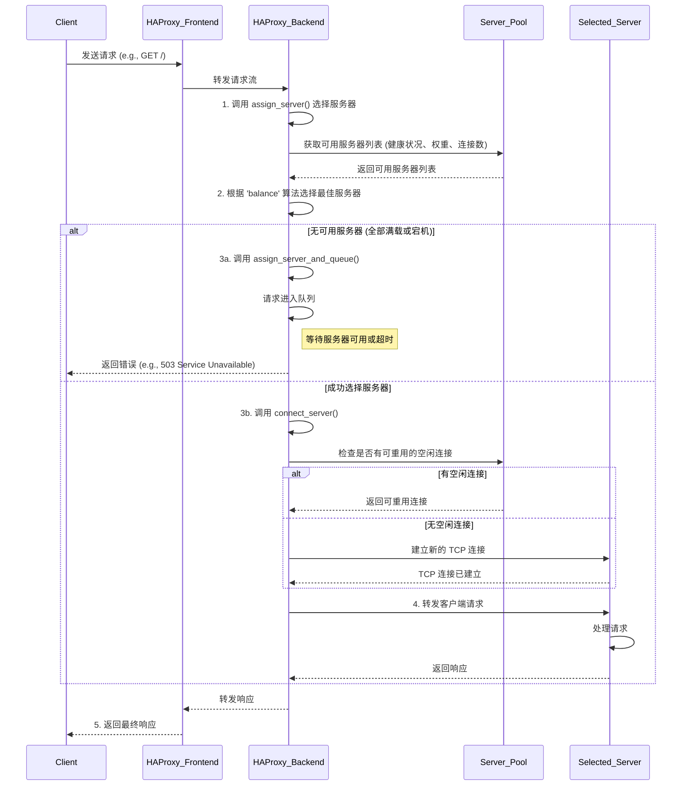
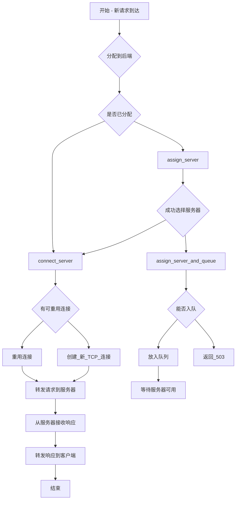

  1. 负载均衡过程设计

  1.1. 时序图 (Sequence Diagram)

  此图展示了从客户端请求到服务器响应的整个过程中，HAProxy 内部各组件的交互顺序。

  1.2. 流程图 (Flowchart)

  此图详细描述了 HAProxy 在处理一个新请求时的内部决策逻辑。

  2. 关键技术分析

  HAProxy 的高性能和高可靠性得益于其精巧的设计和多种关键技术的应用。

  2.1. 事件驱动的非阻塞 I/O 模型

  这是 HAProxy 高性能的基石。HAProxy 采用单进程、事件驱动的模型，通过 epoll (Linux)、kqueue (BSD) 等 I/O 多路复用技术来处理数以万计的并发连接。

   * 工作原理: 单一线程在一个事件循环中等待多个套接字（Socket）上的事件（如数据可读、可写）。当一个事件发生时，相应的回调函数被触发来处理该连接上的数据，而不会因为等待某个连接的 I/O 而阻塞整个进程。
   * 代码关联: ev_epoll.c, ev_kqueue.c 等文件实现了事件循环的底层逻辑。这种模型避免了为每个连接创建一个线程或进程的巨大开销，极大地降低了内存消耗和上下文切换的成本。

  2.2. 模块化的服务器选择逻辑 (assign_server)

  assign_server 函数是负载均衡的核心调度器。它本身不实现具体的算法，而是通过一个策略模式（Strategy Pattern）来调用不同的算法实现。

   * 工作原理: 函数内部通过一个 switch 语句检查后端配置的 lbprm.algo 字段。根据该字段的值，它会调用相应的函数来获取下一个服务器，例如 fwrr_get_next_server (Round Robin)、fwlc_get_next_server (Least Connections)
     或 get_server_sh (Source Hash)。
   * 优势: 这种设计使得添加新的负载均衡算法变得非常容易，只需实现一个新的选择函数并在 switch 语句中增加一个 case 即可，而无需修改核心调度逻辑。

  2.3. 动态权重与慢启动 (server_recalc_eweight)

  为了更智能地分配负载，HAProxy 不仅使用静态权重，还引入了“有效权重”（effective weight）和“慢启动”（slow start）机制。

   * 工作原理: 每个服务器有用户配置的权重 (uweight) 和一个在运行时计算出的有效权重 (eweight)。server_recalc_eweight 函数负责这个计算。当一个服务器从故障中恢复时，slowstart 机制会使其 eweight 从一个较小的值（例如
     1）开始，在配置的时间段内逐渐增长到其 uweight。
   * 代码关联: server_recalc_eweight 函数中的计算 w = (px->lbprm.wdiv * (ns_to_sec(now_ns) - sv->last_change) + sv->slowstart) / sv->slowstart;
     展示了权重如何随时间线性增长。这可以防止一个刚恢复的、缓存为空的服务器被突发的大量请求压垮。

  2.4. 两级连接队列 (assign_server_and_queue)

  当流量洪峰导致所有服务器都达到其 maxconn 限制时，HAProxy 不会立即拒绝请求，而是将其排队。

   * 工作原理: HAProxy 实现了两级队列。首先尝试在选定的服务器级别排队 (srv->queue)。如果服务器队列已满或没有选定服务器（例如，所有服务器都满载），请求会被放入更高级别的后端队列 (be->queue)。pendconn_add
     函数负责将请求（stream）添加到待处理连接队列中。
   * 优势: 这种机制极大地提高了系统的弹性和应对突发流量的能力。它将瞬时的高峰“削平”，在服务器稍有空闲时处理积压的请求，从而保证了服务的可用性，而不是直接向客户端返回错误。

  2.5. 高效的连接重用 (conn_backend_get)

  建立 TCP 连接（尤其是经过 TLS/SSL 加密的）是资源密集型操作。HAProxy 通过维护一个空闲连接池来最小化这种开销。

   * 工作原理: conn_backend_get 函数在需要连接到后端服务器时，会首先尝试从当前线程的连接池 (idle_conns, safe_conns)
     中获取一个已经建立且处于空闲状态的连接。它通过哈希值来匹配连接的属性（如目标服务器、SNI等），确保重用的正确性。
   * 代码关联: 如果配置了 tune.idle-pool.shared，该函数甚至可以从其他工作线程的连接池中“窃取”一个空闲连接，进一步提高了连接的重用率。这显著降低了延迟，并减少了服务器和 HAProxy 本身的 CPU 消耗。